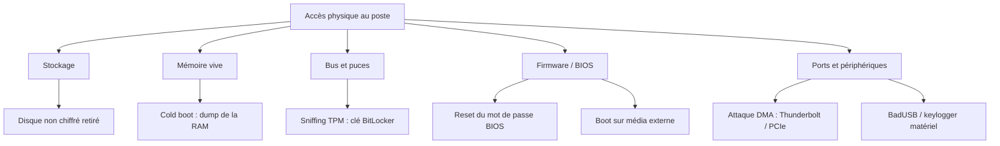

# Sécurité hardware par accès physique
### Catalogue et démonstrations de failles sur poste de travail

> Projet annuel — Bachelor Systèmes Informatiques (BSI), La Salle

Ce projet recense et démontre les failles de sécurité exploitables **quand un attaquant a un accès physique à une machine** : lecture de clés de chiffrement, contournement d'authentification, extraction de données. Pour chaque faille on documente le principe, le matériel nécessaire, les conditions d'exploitation, une preuve de concept, et surtout **la parade** pour s'en protéger.

L'angle est défensif : comprendre comment ces attaques fonctionnent pour savoir s'en défendre et durcir un parc de postes.

## Cadre légal et éthique

Toutes les manipulations sont réalisées **exclusivement sur du matériel personnel**, dans un cadre d'apprentissage.

- Aucune attaque sur du matériel d'un tiers ou d'une entreprise sans autorisation écrite.
- Les données sensibles produites en test (clés de chiffrement, dumps mémoire) ne sont **jamais** publiées dans ce dépôt — elles restent en local.
- But du projet : sensibilisation et défense, pas exploitation malveillante.

## Objectifs

- Cartographier la surface d'attaque « accès physique » d'un poste de travail.
- Démontrer concrètement 2 à 3 attaques sur matériel personnel.
- Produire un guide de durcissement réutilisable.

## Périmètre

Menaces couvertes : vol d'ordinateur portable, poste laissé non surveillé, scénario *evil maid* (accès physique répété).
Hors périmètre : attaques réseau, ingénierie sociale, exploitation logicielle à distance.

## Carte des surfaces d'attaque



## Catalogue des attaques

| Attaque | Principe | Parade principale | Statut |
|---|---|---|---|
| Sniffing TPM / BitLocker | Lire la clé de chiffrement en clair sur le bus entre le TPM et le CPU au démarrage | TPM + PIN au pré-boot, ou TPM firmware (fTPM) | Planifié |
| Attaque DMA | Lire/écrire la RAM en direct via un port Thunderbolt ou PCIe | IOMMU / VT-d, Kernel DMA Protection | À étudier |
| Cold boot | La RAM garde ses données quelques secondes après coupure ; on la dump pour extraire les clés | Chiffrement mémoire, effacement au boot | À étudier |
| Reset BIOS / boot externe | Retirer la pile CMOS ou un jumper pour effacer le mot de passe, puis booter sur clé USB | Mot de passe BIOS + verrou, Secure Boot, boot externe désactivé | À étudier |
| Accès disque direct | Retirer le SSD et le lire sur une autre machine si le disque n'est pas chiffré | Chiffrement complet du disque (BitLocker / LUKS) | À étudier |
| BadUSB | Faux périphérique qui injecte des frappes clavier | Politique USB, blocage des HID non approuvés | À étudier |
| Keylogger matériel | Module intercalé entre le clavier et le PC | Inspection physique, ports scellés | À étudier |

## Structure du dépôt

```
projet-bsi-hardware-sec/
├── README.md              → présentation + sommaire (ce fichier)
├── docs/
│   ├── 00-contexte.md     → problématique + modèle de menace
│   ├── 01-catalogue.md    → catalogue détaillé des attaques
│   ├── attaques/          → une fiche par attaque
│   ├── lab/               → setup, matériel, machines de test
│   └── durcissement.md    → les parades regroupées
├── schemas/               → schémas Mermaid et images
└── poc/                   → preuves de concept, scripts, captures
```

## Matériel de test

*(à compléter avec le matériel réellement utilisé)*

- Machines personnelles de test
- Outillage (analyseur logique / microcontrôleur, tournevis, etc.)

## Équipe

| Nom | Rôle | GitHub |
|---|---|---|
| Gurvan | Lead / rédaction | @… |
| … | … | @… |

## Suivi du projet

Le suivi se fait via les **Issues** (une par attaque à traiter) et l'onglet **Projects** du dépôt.

## Références

- Recherche de *stacksmashing* sur le sniffing de TPM
- Groupe Dolos — extraction de clé BitLocker par sniffing TPM (Surface Pro)
- Thunderspy — attaques DMA via Thunderbolt
- Article fondateur sur les *cold boot attacks* (Halderman et al.)
- Guides de durcissement de l'ANSSI
