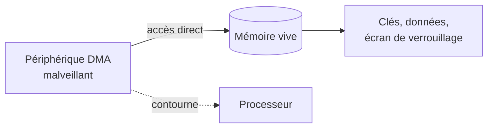

# Attaque DMA (Thunderbolt / PCIe)

## Fiche d'identité

| Critère | Évaluation |
|---|---|
| Gravité | **Élevée** — lecture/écriture directe de la mémoire |
| Complexité | Avancée |
| Matériel | Spécialisé |
| Coût | > 200 € |
| Détectabilité | Discrète (branchement d'un périphérique) |

## Principe

Le DMA (*Direct Memory Access*) permet à certains périphériques d'accéder **directement à la mémoire vive**, sans passer par le processeur, pour des raisons de performance (cartes graphiques, contrôleurs réseau, etc.). C'est utile… mais dangereux : un périphérique malveillant branché sur un port qui autorise le DMA peut **lire et écrire la RAM** de la machine.

En pratique, l'attaquant branche un matériel spécialisé sur un port **Thunderbolt** ou un slot **PCIe** et peut alors extraire le contenu de la mémoire (dont les clés de chiffrement), voire modifier la mémoire à la volée pour, par exemple, contourner l'écran de verrouillage.

## Ce qui se passe

## Conditions

- Un **port autorisant le DMA** est exposé (Thunderbolt notamment).
- La protection **IOMMU / VT-d** est désactivée ou contournable.
- La machine est **allumée ou verrouillée** (les données visées sont en RAM).

## Matériel

- Une carte PCIe spécialisée (type *screamer*) ou un montage Thunderbolt, avec l'outillage logiciel associé (PCILeech, etc.).
- Budget nettement plus élevé que les autres attaques du catalogue (> 200 €).

## Impact

Extraction des clés de chiffrement et de données en mémoire, contournement de l'écran de verrouillage. Gravité élevée car l'attaque touche directement la mémoire vive du système en fonctionnement.

## Parades

| Parade | Efficacité | Coût |
|---|---|---|
| Activer l'**IOMMU / VT-d** | Élevée | Gratuit |
| **Kernel DMA Protection** (Windows) | Élevée | Gratuit (matériel compatible) |
| Désactiver Thunderbolt ou limiter aux périphériques approuvés (BIOS) | Élevée | Gratuit |
| Bloquer les nouveaux périphériques DMA quand la machine est verrouillée | Élevée | Gratuit |

## Tester la parade

1. IOMMU désactivé : tentative de dump mémoire via DMA → mémoire accessible.
2. Activer IOMMU / Kernel DMA Protection.
3. Retenter : l'accès DMA non autorisé est bloqué.
