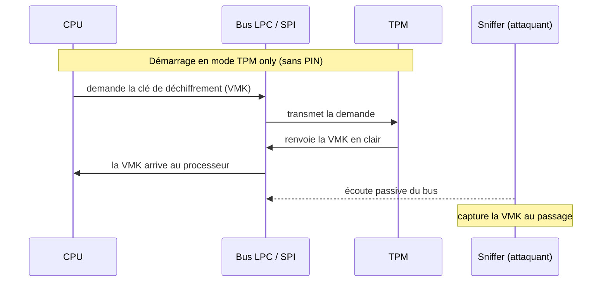

# Sniffing TPM — extraction de la clé BitLocker

## Fiche d'identité

| Critère | Évaluation |
|---|---|
| Gravité | **Critique** — accès complet aux données du disque chiffré |
| Complexité | Intermédiaire à avancée (accès au bus, décodage) |
| Matériel | Spécialisé (analyseur logique ou microcontrôleur) |
| Coût | À partir de ~10 € (Raspberry Pi Pico) |
| Détectabilité | Discrète — il faut ouvrir la machine, mais aucune trace une fois refermée |

## Principe

BitLocker chiffre le disque avec une clé, la *Volume Master Key* (VMK). Le problème n'est pas le chiffrement lui-même, mais **la façon dont la clé est libérée au démarrage**.

Dans la configuration par défaut de BitLocker, dite **« TPM only »**, la VMK est stockée dans le TPM (une puce dédiée à la sécurité). Au démarrage, le TPM vérifie que la machine n'a pas été altérée, puis **libère la clé vers le processeur**. Si aucun code PIN n'est demandé avant le boot, cette libération est automatique et transparente.

La faille : quand le TPM est une **puce séparée soudée sur la carte mère** (TPM « discret », ou dTPM), la clé transite **en clair sur le bus** qui relie le TPM au processeur (bus LPC sur les anciennes machines, SPI sur les plus récentes). Un attaquant qui écoute ce bus au moment du démarrage peut **capturer la VMK au passage**, puis déchiffrer tout le disque tranquillement, sans jamais avoir eu le mot de passe Windows.

## Ce qui se passe au démarrage

La clé apparaît en clair sur le bus parce que rien, dans ce scénario, ne l'oblige à rester secrète : le TPM considère que si la machine démarre normalement, tout va bien.

## Quand l'attaque marche (et quand elle ne marche pas)

**Elle marche si :**
- le TPM est **discret** (puce séparée) avec un bus accessible, **et**
- BitLocker est en mode **TPM only**, sans PIN au pré-boot (le réglage par défaut).

**Elle ne marche pas / devient très difficile si :**
- un **PIN au pré-boot** est activé : sans le PIN, le TPM ne libère pas la clé → il n'y a rien d'exploitable à capturer sur le bus. C'est la parade la plus efficace.
- le TPM est **firmware (fTPM)**, intégré au processeur ou au chipset : il n'y a pas de bus externe à écouter. (Des cas de sniffing SPI existent sur certaines configs, mais c'est nettement plus complexe.)
- le bus n'est physiquement pas accessible.

> **Note pour le lab :** mon IdeaPad (Ryzen 5 5600H) utilise un fTPM intégré au CPU → il n'est pas exploitable par cette méthode. Pour la démonstration, il faut une machine avec un **TPM discret** : typiquement un vieux laptop pro d'occasion (ThinkPad, Dell Latitude, HP EliteBook d'ancienne génération). Vérifier avant achat que le TPM est bien discret et pas firmware.

## Matériel

- Un **analyseur logique** (~15-30 €) ou un **Raspberry Pi Pico** (~10 €) programmé en sniffer.
- De quoi accéder aux broches du bus (fils, éventuellement fer à souder selon la machine).
- Une machine de test avec TPM discret et BitLocker activé en mode TPM only.

## Déroulé (vue d'ensemble)

Le détail de la manip et les captures iront dans `poc/`. Les grandes étapes :

1. Identifier le type de TPM et le bus utilisé (LPC ou SPI).
2. Repérer les points de mesure correspondants sur la carte.
3. Brancher le sniffer sur le bus.
4. Démarrer la machine et capturer le trafic pendant le boot.
5. Retrouver la VMK dans la capture.
6. Utiliser la clé pour monter et lire le volume chiffré sur une autre machine.

*(La reproduction s'appuie sur des recherches publiques — voir Références.)*

## Impact

Si la capture réussit, l'attaquant obtient la clé de chiffrement du disque. À partir de là il peut lire **l'intégralité des données**, hors ligne, sur son propre matériel. Le mot de passe de session Windows, l'antivirus, les protections logicielles : tout est contourné, puisque l'attaque se place **avant** le système d'exploitation. C'est pour ça que la gravité est classée critique.

## Parades

| Parade | Efficacité | Coût |
|---|---|---|
| **Activer TPM + PIN au pré-boot** | Élevée — casse directement l'attaque | Gratuit |
| Privilégier un **fTPM** quand le matériel le permet | Élevée | Gratuit (selon matériel) |
| Politique BitLocker imposant le PIN sur tout le parc | Élevée à l'échelle | Gratuit (GPO) |
| **Scellés anti-intrusion** sur le châssis | Détection, pas prévention | Faible |

La mesure principale à retenir : **BitLocker seul en mode TPM only n'est pas suffisant contre un attaquant physique. Le PIN au pré-boot est la contre-mesure clé.**

## Tester la parade

Démarche de validation pour la démo :

1. Reproduire la capture en mode TPM only → la VMK est récupérable.
2. Activer le PIN au pré-boot.
3. Relancer la même capture → plus rien d'exploitable ne transite sur le bus sans saisie du PIN.

Cette comparaison avant/après est ce qui transforme la démo en vraie démonstration de sécurité.

## Références

- Recherche de *stacksmashing* sur le sniffing de TPM à bas coût (Raspberry Pi Pico).
- Groupe Dolos — extraction de la clé BitLocker par sniffing du TPM sur une Surface Pro.
- Documentation Microsoft sur les contre-mesures BitLocker et l'authentification pré-boot.
