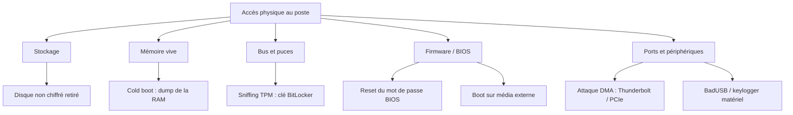

# Sécurité hardware par accès physique

> Catalogue et démonstrations de failles sur poste de travail — Projet annuel BSI

La plupart des protections d'un poste de travail visent l'attaquant **à distance** : pare-feu, antivirus, mots de passe. Mais dès qu'une personne a la machine **physiquement entre les mains**, une grande partie de ces protections tombe.

Ce projet recense et démontre ce qu'un attaquant peut faire avec un accès physique — lecture de clés de chiffrement, contournement d'authentification, extraction de données — et, pour chaque faille, **la parade** pour s'en protéger.

!!! warning "Cadre légal et éthique"
    Toutes les manipulations sont réalisées **exclusivement sur du matériel personnel**, dans un cadre d'apprentissage. Aucune attaque n'est menée sur du matériel d'un tiers sans autorisation. Les données sensibles produites en test (clés, dumps mémoire) ne sont jamais publiées. Objectif : défense et sensibilisation.

## Surface d'attaque

## Par où commencer

- **[Contexte](00-contexte.md)** — la problématique et le modèle de menace.
- **[Catalogue](01-catalogue.md)** — toutes les attaques comparées d'un coup d'œil.
- **[Durcissement](durcissement.md)** — le guide des parades et la checklist.

## Le fil rouge

Une idée relie tout le projet : **la sécurité logicielle s'effondre dès qu'on a la machine en main.** L'accès disque direct le montre de la façon la plus simple ; le reste du catalogue explore les cas où même le chiffrement peut être contourné selon l'état et la configuration de la machine.
